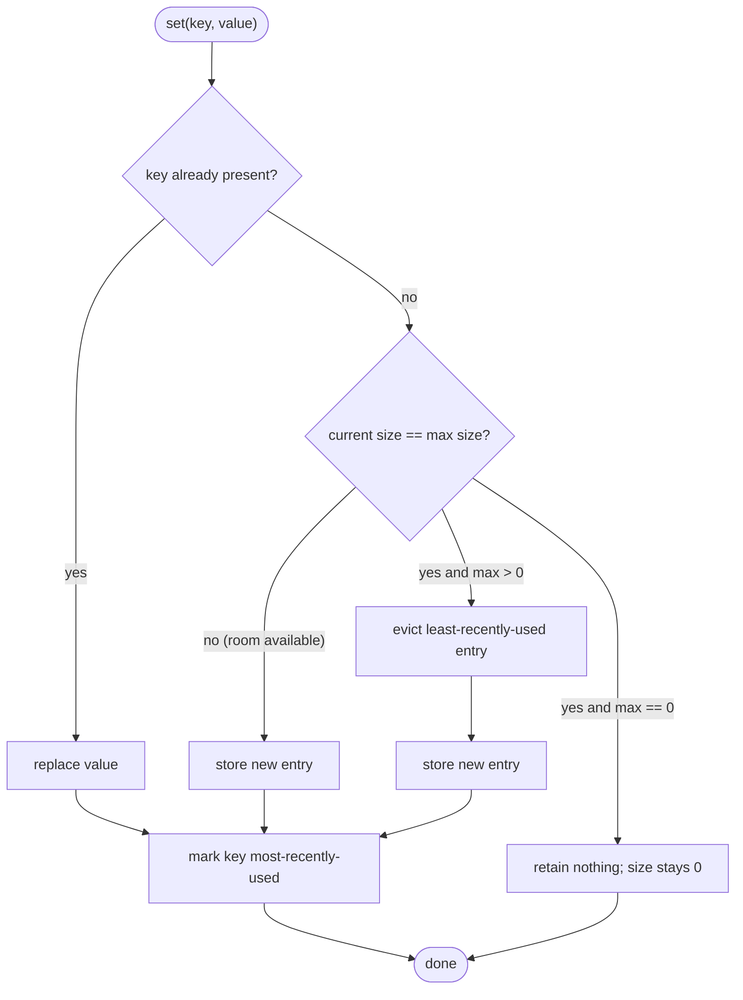
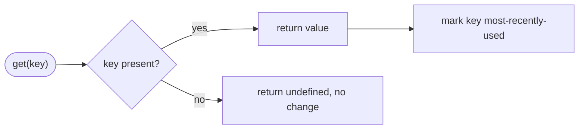
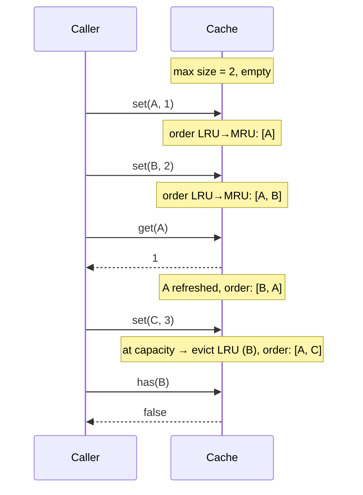

# Spec: LRU cache experiment module | Spec ID: SPEC-01 | Status: draft
Supersedes: none

## Problem and why

The playground needs a small, self-contained LRU (Least Recently Used) cache
experiment: a bounded key/value store that keeps only the most recently used
entries and evicts the least recently used one when it overflows. It exists as a
teaching/experiment module in the same spirit as `greet` — a small, side-effect-free
module under `src/` with a matching test file — so it must fit the repo's conventions
(ES modules, named export, `node:test`/`node:assert`, no runtime dependencies) rather
than pull in an external cache library.

The value of writing this as a spec first: "least recently used" hides several
real decisions (does reading refresh recency? does a mere existence check? what
happens at capacity 0 or 1? how is a stored `undefined` told apart from a miss?)
that must be pinned down before code so the behavior is unambiguous and testable.

## Goals / Non-goals

Goals:
- A bounded cache with a fixed maximum number of entries, chosen at construction time.
- `get` and `set` operations, where **both** count as "using" an entry and move it to
  most-recently-used position.
- Automatic eviction of the single least-recently-used entry when a `set` of a *new*
  key would exceed the maximum size.
- Observable state: an existence check and a current-size readout.
- Deterministic, in-process behavior with no external dependencies, matching the
  playground conventions.

Non-goals (explicitly out of scope for this spec):
- No TTL / time-based expiry of entries.
- No explicit `delete`, `clear`, `peek`, or iteration (`keys`/`values`/`entries`)
  methods — see `[NEEDS CLARIFICATION]` for a suggestion to add some later.
- No eviction callback / event hook when an entry is evicted.
- No concurrency or thread-safety guarantees beyond JavaScript's single-threaded
  execution model.
- No persistence, serialization, or size-in-bytes accounting (the bound is a count of
  entries, not a memory budget).
- No LFU / FIFO / other eviction policy — strictly least-recently-used.

## User stories

- As a playground author, I want a bounded cache so that a long-running experiment
  keeps memory bounded by discarding the entries it has used least recently.
- As a caller, I want reading a key to keep it "hot" so that entries I actively use are
  not the ones evicted.
- As a caller, I want to distinguish "this key is absent" from "this key holds the
  value `undefined`" so that my miss handling is correct.
- As a test author, I want observable `size` and existence checks so that I can assert
  eviction happened without reaching into internals.

## Acceptance criteria (EARS)

- **AC-1** — WHEN a cache is created with a maximum size that is an integer greater than
  or equal to 0, the system shall accept it and initialize an empty cache whose current
  size is 0.
- **AC-2** — IF a cache is created with a maximum size that is not an integer >= 0 (for
  example a negative number, a fractional number, `NaN`, or a non-number), THEN the
  system shall throw an error and shall not create a usable cache.
- **AC-3** — WHEN `set` is called with a key not currently present and the current size
  is below the maximum, the system shall store the key/value entry, increase current
  size by one, and mark that entry most-recently-used.
- **AC-4** — WHEN `set` is called with a key already present, the system shall replace
  that key's value, leave the current size unchanged, and mark that entry
  most-recently-used.
- **AC-5** — IF `set` is called with a key not currently present WHILE the current size
  already equals the maximum size (and the maximum is greater than 0), THEN the system
  shall evict exactly the least-recently-used entry before storing the new entry, so
  that current size remains equal to the maximum.
- **AC-6** — WHEN `get` is called with a key that is present, the system shall return
  that key's stored value and mark that entry most-recently-used.
- **AC-7** — WHEN `get` is called with a key that is not present, the system shall return
  `undefined` and shall leave the cache contents, recency order, and size unchanged.
- **AC-8** — WHILE the cache is at maximum size, the system shall determine the entry to
  evict on the next new-key `set` as the one whose most recent `get` or `set` is oldest,
  so that an entry refreshed by a `get` is not evicted ahead of an older, untouched entry.
- **AC-9** — WHEN the existence-check operation is called for a key, the system shall
  return `true` if the key is present and `false` otherwise, without changing recency
  order, contents, or size (it is a non-mutating peek).
- **AC-10** — The system shall expose the current number of stored entries as a
  read-only size value that is always an integer between 0 and the configured maximum,
  inclusive.
- **AC-11** — WHERE the maximum size is 0, the system shall retain no entries: after any
  `set` the current size shall remain 0, and both `get` and the existence check shall
  report a miss for every key.
- **AC-12** — WHERE the maximum size is 1, the system shall retain only the single
  most-recently-used entry, evicting the previously stored entry whenever a `set` with a
  different key occurs.
- **AC-13** — WHEN a key is stored with the value `undefined`, the system shall report
  the existence check as `true` for that key while `get` returns `undefined`, so that a
  stored-`undefined` entry is distinguishable from an absent key.
- **AC-14** — IF `set` is called with a key already present WHILE the cache is at maximum
  size, THEN the system shall update that key's value and evict no entry, leaving the
  current size unchanged.
- **AC-15** — WHEN a key whose name collides with object-prototype property names (for
  example `"__proto__"`, `"constructor"`, or `"prototype"`) is used, the system shall
  treat it as an ordinary distinct key and shall not corrupt storage or behavior for any
  other key.
- **AC-16** — WHEN two keys are compared for identity, the system shall treat them as the
  same entry using the same equality as the standard `Map` (SameValueZero), so that two
  distinct object references are distinct keys and `NaN` is usable as a single key.

## Edge cases

- **Maximum size of 0** — cache never retains anything (AC-11). Treated as a valid
  configuration, not an error (see `[NEEDS CLARIFICATION]` to confirm 0 should not throw).
- **Maximum size of 1** — every `set` of a new key evicts the prior entry (AC-12).
- **Updating an existing key** — no size growth, no eviction, recency refreshed
  (AC-4, AC-14).
- **Getting a missing key** — returns `undefined`, no mutation (AC-7).
- **Stored `undefined` value** — indistinguishable from a miss via `get` alone; the
  existence check disambiguates (AC-13).
- **Eviction order after reads** — a `get` on an old entry protects it from being the
  next evicted (AC-8).
- **Prototype-polluting key names** — `"__proto__"` and friends behave as ordinary keys
  (AC-15), derived from the prototype-pollution guidance in the repo's security skill.
- **Object / `NaN` keys** — key identity follows `Map` semantics (AC-16).
- **Invalid capacity** — negative, fractional, `NaN`, or non-number maximum throws
  (AC-2).

## Non-functional

- **Performance** — `get`, `set`, and the existence check are expected to run in
  constant time (amortized O(1)) independent of the number of stored entries, which is
  the standard property an LRU cache is chosen for. This is a design expectation, not an
  observably asserted acceptance criterion (constant-time behavior is not reliably
  unit-testable), so it is recorded here rather than under Acceptance criteria.
- **Security** — None beyond AC-15: this is a pure in-memory data structure with no
  network, filesystem, `eval`, or dynamic code execution. Keys and values are opaque and
  are never interpreted as instructions. See Untrusted inputs.
- **Accessibility** — None. Not applicable to a non-visual library module.

## Architecture & workflows

The cache maintains, conceptually, (1) a key→value store and (2) a recency ordering
from least-recently-used (LRU) to most-recently-used (MRU). Every `get` hit and every
`set` moves the touched key to the MRU end; eviction always removes from the LRU end.
This describes WHAT happens and in what order, not how the ordering is implemented.

Recency example (maximum size 2), showing that a `get` protects an entry from eviction:

## Service contracts

This module exposes a single in-process object interface (no HTTP, no cross-service
IO). The observable interface — the contract callers depend on — is:

- **Construction** — takes one argument, the maximum size: an integer >= 0. Produces an
  empty cache. Invalid maximum (see AC-2) throws.
- **get(key)** → returns the stored value for `key`, or `undefined` if absent. Side
  effect: refreshes `key` to most-recently-used when present.
- **set(key, value)** → stores or updates `key`. Side effect: refreshes `key` to
  most-recently-used; may evict the least-recently-used entry (AC-5). Return value of
  `set` is left unspecified by this contract — see `[NEEDS CLARIFICATION]`.
- **existence check (key)** → returns a boolean; non-mutating (AC-9).
- **size** → read-only integer count of current entries, 0..maximum (AC-10).

Key equality follows standard `Map` SameValueZero semantics (AC-16). Values may be any
JavaScript value, including `undefined` (AC-13). No shared cross-module schema (e.g. a
Zod contract) is involved — the interface is a plain in-process object.

## Inputs (provenance)

- **Maximum size (constructor argument)** — `[deterministic: caller-supplied in-process
  argument]`. Provided directly by the calling code at construction. No LLM, no external
  source. Evidence: mirrors the caller-supplied-argument pattern of the existing
  `greet` module (`src/greet.js:8`).
- **Keys and values (`get`/`set`/existence-check arguments)** — `[deterministic:
  caller-supplied in-process arguments]`. Passed directly by the calling code; never
  fetched, parsed from a network payload, or model-generated.
- No `[reused: L0X]` and no `[new: N LLM calls]` inputs exist — this module makes no
  model calls and consumes no prior pipeline output.

## Untrusted inputs

None. This is a pure in-memory data structure. It reads no external text (no LLM output,
no imported file contents, no diff bodies, no webhook/GitHub payloads, no network
responses) and executes nothing derived from its inputs — keys and values are stored and
returned as opaque data, never interpreted as commands, and no `eval`/dynamic execution
is involved. The one adversarial-shaped concern that survives — key names that collide
with object-prototype properties (e.g. `"__proto__"`) — is handled as ordinary data by
AC-15 so it cannot corrupt the cache, per the prototype-pollution guidance in the repo's
security skill.

## Traceability

| AC-N | Evidence |
|---|---|
| AC-1 | User requirement: "a configurable maximum size"; empty-start mirrors `greet` module simplicity (`src/greet.js`) |
| AC-2 | User requirement: "configurable maximum size" implies a valid bound; defensive-throw pattern mirrors `greet` input validation (`src/greet.js:9-11`) |
| AC-3 | User requirement: "`get`/`set` operations and a configurable maximum size" |
| AC-4 | User requirement: "updating an existing key" (edge case list in request) |
| AC-5 | User requirement: "When the cache exceeds max size on a `set`, the least-recently-used entry is evicted" |
| AC-6 | User requirement: "Both `get` and `set` count as 'using' an entry (they refresh its recency)" |
| AC-7 | User requirement: "getting a missing key" (edge case list in request) |
| AC-8 | User requirement: "they refresh its recency" + "least-recently-used entry is evicted" + "eviction order" (edge case list) |
| AC-9 | User requirement: "any observable behavior like `size`/`has`"; peek (non-refresh) derived from request enumerating only `get`/`set` as refreshing |
| AC-10 | User requirement: "any observable behavior like `size`/`has`" |
| AC-11 | User requirement: edge case "max size of 0" |
| AC-12 | User requirement: edge case "max size of 1" |
| AC-13 | Derived edge: values may be `undefined`; `has` needed to disambiguate a miss (JS `Map`/`undefined` semantics) |
| AC-14 | User requirement: "updating an existing key" combined with "exceeds max size" — update at capacity must not evict |
| AC-15 | Repo security skill "Framework Security Quirks → JavaScript/Node.js: Prototype pollution via `__proto__`/`constructor.prototype` — validate object keys" |
| AC-16 | Standard `Map` SameValueZero key-equality semantics (Node.js `node:test`/JS built-in behavior the module is built on) |

## Verification

Each recipe is an observable behavior check runnable with `node:test` / `node:assert`
(the repo's standard, per `test/greet.test.js`), asserting only via the public interface.

| AC-N | Verification recipe |
|---|---|
| AC-1 | Create a cache with maximum 3; assert size is 0 and any `get` returns a miss. |
| AC-2 | Attempt construction with `-1`, `1.5`, `NaN`, and a string; assert each throws. |
| AC-3 | On a maximum-3 empty cache, `set(a)`; assert size is 1 and `get(a)` returns the value. |
| AC-4 | `set(a,1)` then `set(a,2)`; assert `get(a)` is 2 and size stayed 1. |
| AC-5 | Fill a maximum-2 cache with a,b then `set(c)`; assert size is 2 and the oldest untouched key (a) is now absent. |
| AC-6 | After filling, `get(a)` and confirm the returned value, then trigger one eviction and assert a survived (see AC-8). |
| AC-7 | `get` a never-inserted key; assert it returns `undefined` and size is unchanged. |
| AC-8 | max 2: `set(a)`, `set(b)`, `get(a)`, `set(c)`; assert b was evicted and a,c remain. |
| AC-9 | `set(a)`; call existence check for a (true) and for absent b (false); confirm order/size unaffected by comparing eviction outcome to a run without the checks. |
| AC-10 | Insert entries up to and beyond maximum; assert size never exceeds maximum and equals expected count at each step. |
| AC-11 | max 0: `set(a)`; assert size stays 0, `get(a)` is a miss, existence check for a is false. |
| AC-12 | max 1: `set(a)`, `set(b)`; assert a absent, b present, size 1. |
| AC-13 | `set(a, undefined)`; assert existence check for a is true while `get(a)` is `undefined`; compare against an absent key whose existence check is false. |
| AC-14 | Fill a maximum-2 cache with a,b; `set(a, 9)`; assert size still 2, both a and b present, `get(a)` is 9. |
| AC-15 | `set("__proto__", 1)`, `set("constructor", 2)`, `set("x", 3)`; assert each `get` returns its own value and none affects the others or a normal key. |
| AC-16 | Use two distinct object references as keys and confirm they are separate entries; store `NaN` as a key and confirm a single retrievable entry. |

## [NEEDS CLARIFICATION: …]

1. **Does the existence check (`has`) refresh recency?** This spec assumes **no** — it is
   a non-mutating peek (AC-9) — because the request enumerates only `get` and `set` as
   operations that "count as using an entry." Please confirm `has` should not refresh.
2. **What should `set` return?** The contract currently leaves it unspecified. Common
   options are the cache instance (for chaining) or `undefined`. Please confirm the
   desired return value, or accept "unspecified."
3. **Is a maximum size of 0 valid, or should it throw?** This spec treats 0 as a valid
   "retain nothing" cache (AC-11) because the request lists "max size of 0" as an edge
   case to cover. If 0 should instead be rejected at construction, AC-2 and AC-11 must be
   swapped accordingly.
4. **UX / scope suggestions (not in the current request):** consider adding `delete(key)`,
   `clear()`, a non-refreshing `peek(key)`, and iteration (`keys`/`values`/`entries` in
   recency order) in a future revision. They are deliberately Non-goals here; flagging in
   case they belong in scope now.
